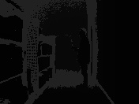
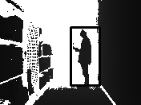

# Path Estimation

This program decides a path around a human standing in a corridor using depth image.

## Getting Started

These instructions will get you a copy of the project up and running on your local machine for development and testing purposes. See deployment for notes on how to deploy the project on a live system.

### Dependencies

Python 2.7  
*See [Installing python](https://www.python.org/download/releases/2.7/) for instructions on how to install python.*  
openCV 3.4
*See [Installing openCV3.4](http://www.python36.com/how-to-install-opencv340-on-ubuntu1604/) for instructions on how to install openCV3.4.*
## How to run

open a terminal or console. Change the operating directory to where the ```find_clearance.py``` is  and type in

```
python find_clearance.py ~/human_corridor_0.txt
```
The argument is the text file representing the depth image

## Program structure

The program in the main function takes in the directory path to the depth image and passes it to the function ```find_path()```.

The  ```find_path()``` function loads the depth image shown below



The image is rescaled and thresholded to a range of 0-255.
as shown below


The image is then blurred with Gaussian Blur which is used to classify a human and his position in the image using Harr Cascade.



The depth value of the human is computed. The pixel coordinates of the wall and the shelve in front and back of the human is computed using the depth value of the human. This is used to compute the length of the corridor in pixel values. This is in turn used to calculate the focal length using the knowledge of the length of the corridor in meters.

```
focal_length = (pixel_width_corridor * depth_point_corridor)
               ______________________________________________
                      actual_width_corridor
```
This focal length is used to get the distance between the wall and the human in meters. It is thresholded with respect to the center of the corridor to classify the best path for the robot.

## Authors

* **Rakshith Subramanyam** -  [github](https://github.com/Rakshith-2905)


## License

None
